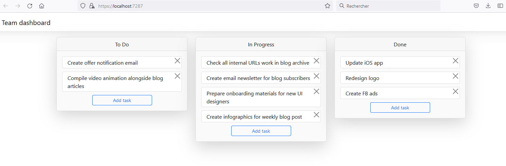

# SignalR Trello Example

This project is a simplified version of [Trello](https://trello.com/) to learn [SignalR](https://github.com/SignalR/SignalR).

Users can add tasks, move them from one status to another, update them and delete them. SignalR is used because the execution of each of these actions must be reflected to all client-side web applications instantly, without them needing to pull information from the server. SignalR allows server code to send asynchronous notifications (push) to clients.

